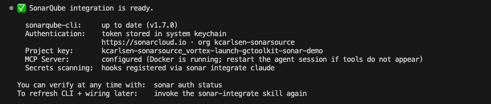
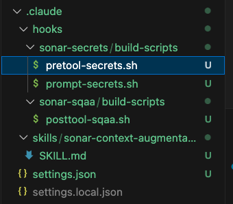
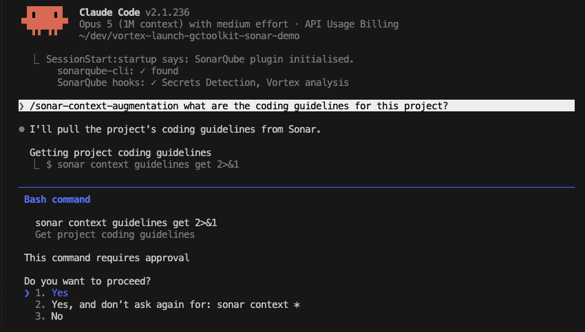
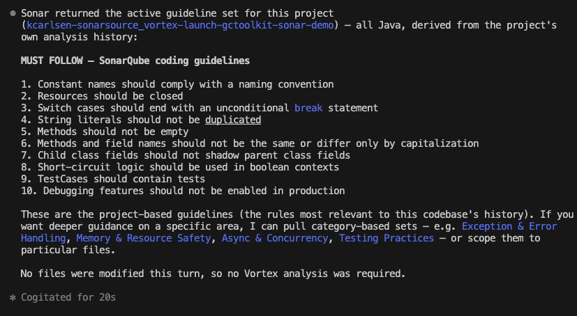
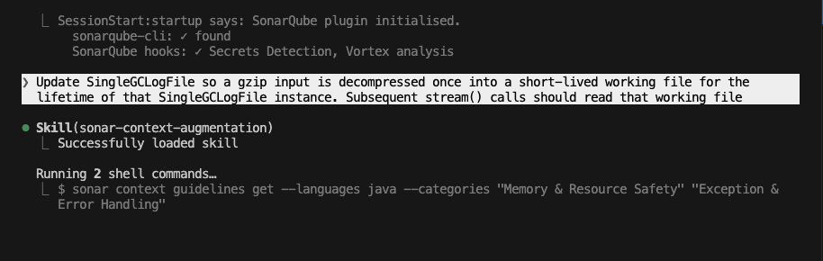
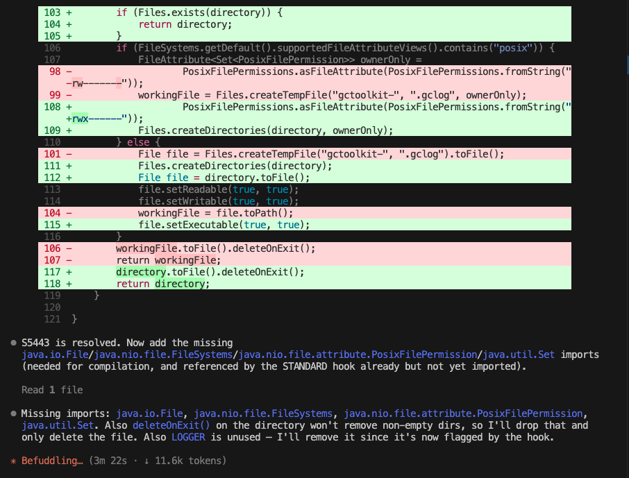
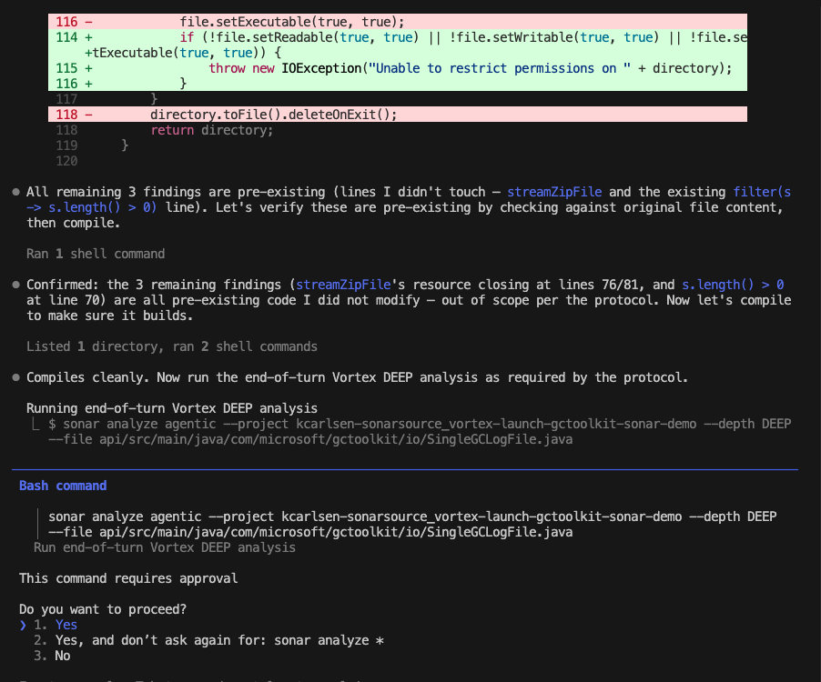
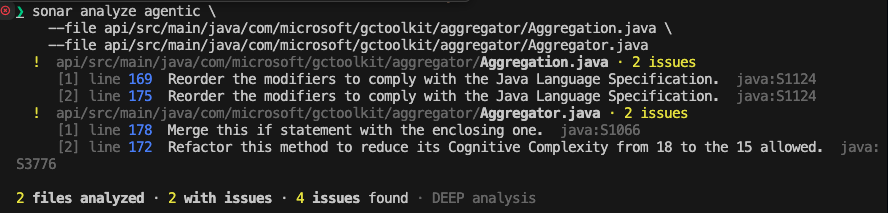

# How to set up Sonar Vortex in Claude Code

> Last updated: September 2026
>
> The observed demo output reflects its recorded environment and may differ by release, project, organization, and entitlement. Check the current SonarQube documentation before using these instructions in a live environment.

## TL;DR overview

- Sonar Vortex brings project guidance and code verification into Claude Code. In this walkthrough, Vortex context supplied resource-safety guidance before an edit, and Vortex analysis caught an insecure temporary-file choice and drove a correction before the turn finished.  
- The PostToolUse hook integration analyzes each Edit or Write action, while managed project instructions direct an end-of-turn DEEP analysis across modified files.  
- The hook integration also adds secrets detection for prompts and file reads. Capability support varies by language, with the complete Vortex analysis matrix provided below.

This blueprint sets up [Sonar Vortex](https://www.sonarsource.com/products/sonar-vortex/) inside Claude Code so your agent can load project-specific coding standards before it generates code and then analyze each edit with SonarQube. This particular walkthrough uses a fork of Microsoft's [gctoolkit](https://github.com/microsoft/gctoolkit) with Java and Maven to showcase Vortex capabilities. The first of these that will be addressed is Vortex context, which gives the agent project rules, architecture information, and code context. The second is Vortex analysis, which examines files the agent changes (without waiting for the next pipeline run) and prompts fixes within the code generation loop.

## When to use this

Use this workflow when you want Claude Code to follow your project's existing coding standards and catch issues as it writes code, before a PR triggers CI. The steps follow the Claude Code plugin path starting from installation.

## What you'll achieve

- The SonarQube plugin installed in Claude Code with the MCP server running in a Docker container  
- Vortex context delivering coding guidelines and semantic code navigation, plus architecture context when SonarQube Architecture data is available, as well as dependency health checks when SCA is enabled  
- Automatic Vortex analysis on every code edit via a PostToolUse hook  
- Secrets detection hooks preventing credentials from leaking into agent prompts  
- Multi-file DEEP analysis available from the CLI for cross-file issue detection

## Architecture


The first of the two layers of this integration is the **SonarQube plugin**, which gives Claude Code setup skills and a SessionStart hook that reports CLI and hook status. The second is the **SonarQube CLI**, invoked through `/sonarqube:sonar-integrate`, which adds the project resources used in this walkthrough (Vortex analysis and secrets detection hooks, the Vortex context skill, a project-scoped MCP configuration, and managed end-of-turn analysis instructions in `CLAUDE.md`).

The CLI-generated MCP configuration launches the `sonarsource/sonarqube-mcp` Docker container with SonarQube tools for project queries, issues, rules, quality gates, and coverage. It excludes the optional MCP Vortex tools because this workflow runs Vortex analysis through the CLI and hooks, while the `/sonar-context-augmentation` skill calls `sonar context` for Vortex context.

## What you need before setting up SonarQube with Claude Code

- [SonarQube Cloud](https://www.sonarsource.com/products/sonarqube/cloud/) account on an Enterprise plan or annual Team plan.  
- [Sonar Agent Essentials](https://www.sonarsource.com/products/agent-essentials) subscription active for your org. See [plans and pricing](https://www.sonarsource.com/plans-and-pricing/).  
- Claude Code installed and working  
- Docker Desktop, Podman, or Nerdctl running, because the MCP server runs as a Docker container  
- A project analyzed in CI on a long-lived branch (for example, `main`). This is a prerequisite for Vortex analysis, which restores CI-collected dependencies, compiled artifacts, type information, and build configuration by project key and branch for full precision. Local semantic navigation and catalog-based guidelines work without CI analysis. If you have not set this up, follow [the SonarQube Cloud GitHub Actions guide](https://docs.sonarsource.com/sonarqube-cloud/analyzing-source-code/ci-based-analysis/github-actions-for-sonarcloud/). Automatic Analysis is not sufficient for Java projects because only basic analysis results are returned.  
- The integration checks whether the SonarQube CLI is installed and provides installation guidance when it is missing. To install it beforehand, see [cli.sonarqube.com](https://cli.sonarqube.com).

This demonstration remains scoped to SonarQube Cloud. SonarQube Server 2026.5 Enterprise and Data Center editions support Claude integration and Vortex analysis with a Vortex subscription, but this blueprint does not promise the complete CLI-native Vortex context capability set on SonarQube Server.

## Step 1. Install and activate the plugin

Open Claude Code in any directory, run `/plugin` to open the plugin browser, search for `sonarqube` in the Discover tab, and install with local (repository-only) scope:


The plugin's slash commands become available in the same session without a restart. You can also install directly with `/plugin install sonarqube@claude-plugins-official`.

## Step 2. Configure the integration

Open a new Claude Code session in your project directory. The plugin's SessionStart hook should fire and check for existing integration. If setup is incomplete, it tells you.

Run the integration skill:

```shell
/sonarqube:sonar-integrate
```

The skill guides you through several checks:

1. **CLI check**: verifies that the SonarQube CLI is installed and provides installation guidance when it is missing.  
2. **Auth check**: runs `sonar auth status`. If you are already authenticated, it skips ahead.  
3. **Auth login**: if needed, connects to your configured SonarQube platform and completes browser-based authentication.  
4. **Container runtime check**: verifies that Docker, Podman, or Nerdctl is available and running.  
5. **Integration**: asks whether to configure the current project or globally. Choose "Current project only" (recommended), because Vortex is project-scoped and global integration skips it. The skill delegates to `sonar integrate claude --non-interactive`.

With authentication already configured, the skill skipped the login flow, confirmed the latest CLI version, and proceeded directly to scope selection. After selecting "Current project only," the CLI discovered the project from the `origin` Git remote and installed all components:

```
Installed
  ✓  secret scanning hooks
  ✓  Vortex analysis hook
  ✓  Vortex
  ✓  MCP server

=== Setup complete! ===
```

In a subsequent fresh session, the SessionStart hook confirmed both integrations:

```
SessionStart:startup says: SonarQube plugin initialised.
  sonarqube-cli: ✓ found
  SonarQube hooks: ✓ Secrets Detection, Vortex analysis
```

If you are not already authenticated, you will see the connection-type selection and login steps before the scope prompt. The integration output also instructs you to restart the session if MCP tools do not appear.



## Step 3. Review the generated resources

After integration, the CLI generates the project resources that connect Claude Code to SonarQube. The exact set depends on Vortex eligibility and the selections made during integration.

**MCP server config** (`.mcp.json`):

```json
{
  "mcpServers": {
    "sonarqube": {
      "command": "sonar",
      "args": ["run", "mcp", "--project", "<YOUR_PROJECT_KEY>"]
    }
  }
}
```

The `sonar run mcp` command launches the `sonarsource/sonarqube-mcp` Docker container with stdio transport. The CLI exposes generic tool categories for issues, rules, quality gates, coverage, and other project queries while excluding the optional MCP Vortex tools. Vortex context uses `sonar context`, and Vortex analysis uses the CLI's direct analysis path.

**Hook configuration** (`.claude/settings.json`):

In this run, the generated settings contained three hook-event entries.

```json
{
  "hooks": {
    "PreToolUse": [
      { "matcher": "Read", "hooks": [{ "type": "command", "command": "...pretool-secrets.sh" }] }
    ],
    "UserPromptSubmit": [
      { "matcher": "*", "hooks": [{ "type": "command", "command": "...prompt-secrets.sh" }] }
    ],
    "PostToolUse": [
      { "matcher": "Edit|Write", "hooks": [{ "type": "command", "command": "...posttool-sqaa.sh" }] }
    ]
  }
}
```

Each hook serves a different purpose:

- **PreToolUse** (matcher: `Read`): secrets detection. Scans file content before it enters the agent's context.  
- **UserPromptSubmit** (matcher: `*`): secrets detection. Scans every user prompt for credentials before processing.  
- **PostToolUse** (matcher: `Edit|Write`): Vortex analysis. Fires after code edits, sending the changed file to SonarQube's analysis engine.

The PostToolUse hook points to a shell script wrapper that checks for the `sonar` CLI on PATH and then calls:

```shell
sonar hook claude-post-tool-use --project '<YOUR_PROJECT_KEY>'
```

**Managed end-of-turn instructions** (`CLAUDE.md`): For a Vortex-eligible and project-scoped integration, the CLI adds a protocol to the project-root `CLAUDE.md`. The protocol instructs Claude Code to run `sonar analyze agentic --depth DEEP` before completing a turn that had file changes. It then directs the agent to fix findings on lines it touched and rerun analysis. These are installed agent instructions rather than enforcement: the CLI runs the analysis, while agent compliance with the full protocol depends on the model's adherence to the instructions.

**Vortex context skill** (`.claude/skills/sonar-context-augmentation/SKILL.md`): The installed skill is how Claude Code accesses Vortex context. It calls `sonar context` CLI commands, using a dependency graph built from the local workspace for semantic navigation and SonarQube Architecture data for architecture queries.

**Hook scripts** (`.claude/hooks/`): Shell script wrappers for secrets detection and Vortex analysis.



## Step 4. Load Vortex context

Vortex context provides coding guidelines and semantic code navigation. When SonarQube Architecture data is available, it also provides architecture context, while dependency health checks require SCA. Project-specific guidelines use historical SonarQube issues from the project, while catalog-based guidelines work without project issue history.

The integration installs a project-scoped `/sonar-context-augmentation` skill. The agent may load context on its own when the task calls for it (Step 5), but invoke the skill explicitly when you want to guarantee that guidance is loaded before the agent starts writing code.

Invoke the skill:

```shell
/sonar-context-augmentation what are the coding guidelines for this project?
```

Here, Claude Code requested approval before running `sonar context guidelines get`. On first invocation, the command auto-started a local daemon for the workspace and returned project-specific guidelines under a `MUST FOLLOW` heading with a numbered rules list:





To explore architecture, invoke the skill again:

```shell
/sonar-context-augmentation show me the top-level architecture of this project
```

The skill calls `sonar context architecture get-current --ecosystem java --depth 0` and returns root-level modules with their fully qualified names. Architecture tools support Java, JavaScript, TypeScript, Python, and C\#.

Semantic navigation supports Java, C\#, JavaScript, TypeScript, Python, and Rust.

## Step 5. Use Vortex analysis during a code edit

Vortex analysis runs as Claude Code works. Every time Claude Code uses the Edit or Write tool, the PostToolUse hook sends the changed file to SonarQube's analysis engine, which lets the agent act on feedback before it finishes the turn.

In this walkthrough, the prompt was:

```
Update SingleGCLogFile so a gzip input is decompressed once into a short-lived
working file for the lifetime of that SingleGCLogFile instance. Subsequent
stream() calls should read that working file
```

Claude Code automatically loaded the Vortex context skill before editing and retrieved resource-safety and exception-handling guidance, including "Temporary files should not be created in publicly writable directories" and "Resources should be closed."

The initial implementation created a working file in the default system temporary directory. Vortex analysis returned feedback to Claude Code through `additionalContext`. Claude Code retrieved the full `java:S5443` rule through the MCP server, revised the implementation to use an owner-only application directory, and resolved the insecure temporary-file choice without a corrective user prompt. After each edit, Claude Code displayed `3 PostToolUse hooks ran`.





During the same turn, Claude Code removed an unused `LOGGER` field, corrected ignored return values from file-permission setters, and compiled cleanly under Maven.

The managed end-of-turn protocol then directed a single-file DEEP analysis, which required approval and returned three findings on untouched lines: two `java:S2095` resource-closing issues in `streamZipFile` and one `java:S7158` string-emptiness issue. The command exited 51 because pre-existing findings were present. Claude Code distinguished those pre-existing findings from its own changes and reported no new findings on the modified code.



The PostToolUse hook and the `sonar analyze agentic` CLI command both invoke SonarQube's analysis engine. The hook fires automatically on every edit, sending one file per invocation. The `sonar analyze agentic` command is available for on-demand or end-of-turn analysis, either through the managed `CLAUDE.md` instructions or direct CLI invocation. For cross-file detection, use multi-file analysis.

## Step 6. Run multifile DEEP analysis

It’s possible to invoke Vortex multi-file analysis using the CLI directly with multiple `--file` flags:

```shell
sonar analyze agentic \
  --file api/src/main/java/com/microsoft/gctoolkit/aggregator/Aggregation.java \
  --file api/src/main/java/com/microsoft/gctoolkit/aggregator/Aggregator.java
```

When you pass two or more files, the CLI activates DEEP mode automatically. DEEP analysis sends all files together so the engine can detect issues that span file boundaries.

Here, two files were analyzed without explicit `--project`, `--branch`, or `--depth` flags:



The CLI activated DEEP analysis automatically because two files were passed, and the command exited 51 because findings were present.

The `--project` and `--branch` flags are optional when you run from a configured project directory. The CLI resolves the project key from its integration state or project configuration, and detects the current Git branch automatically. You only need these flags when running from outside the project or targeting a different branch.

To force a specific analysis depth on a single file:

```shell
sonar analyze agentic \
  --file api/src/main/java/com/microsoft/gctoolkit/aggregator/Aggregation.java \
  --depth DEEP
```

The `--depth` flag accepts `STANDARD` (default for single files) or `DEEP` (default for multiple files and change sets). If the payload is too large, the CLI splits files into smaller batches automatically.

## Verify the setup

Start a fresh Claude Code session in the project directory, then work through this checklist:

- [ ] Confirm that SessionStart reports `sonarqube-cli: ✓ found` and `SonarQube hooks: ✓ Secrets Detection, Vortex analysis`.  
- [ ] Check that the project contains `.mcp.json`, `.claude/settings.json`, the generated hook scripts, `.claude/skills/sonar-context-augmentation/SKILL.md`, and the managed `CLAUDE.md` instructions.  
- [ ] Run `/sonar-context-augmentation what are the coding guidelines for this project?` and confirm that Vortex context returns project-specific results.  
- [ ] Ask Claude Code to make a controlled code edit, confirm that the PostToolUse status appears, and review how the agent handles any Vortex analysis feedback.  
- [ ] While the Claude Code session is active, run the command for the container runtime selected by the CLI in another terminal and confirm that the SonarQube MCP container appears:

```shell
# Docker
docker ps --format "{{.Image}}\t{{.Status}}"

# Podman
podman ps --format "{{.Image}}\t{{.Status}}"

# Nerdctl
nerdctl ps --format "{{.Image}}\t{{.Status}}"
```

The output should include a running container,

## What to know

### Project scope and analysis context

The agent may invoke `/sonar-context-augmentation` when a task calls for context, as it did in Step 5. Invoke the skill explicitly at the start of a coding task when you need to guarantee that project guidance is loaded.

Vortex is project-scoped because it needs a project key and project-local files, so choose the current-project integration in Step 2. Run CI analysis on a long-lived branch before using Vortex analysis because the stored dependencies, compiled artifacts, type information, and build configuration enable full analysis precision. Java projects that use Automatic Analysis receive only basic results.

The `sonar system status` command reports Vortex entitlement and usage state. When usage is exhausted, the CLI keeps the integration in place and reports when use can resume.

### SonarQube Server availability

SonarQube Server 2026.5 Enterprise and Data Center editions support Claude integration and Vortex analysis with a Vortex subscription. This walkthrough and prerequisites use SonarQube Cloud.

### Language support

| Capability | Supported languages |
| :---- | :---- |
| Vortex analysis | Apex, C, C\#, C++, CSS, Dart, Docker, Go, Groovy, HTML, Java, JavaScript, Kotlin, Kubernetes, Objective-C, PHP, PowerShell, Python, Ruby, Shell, SQL, Swift, Terraform, TypeScript, VB.NET |
| Secrets detection | All files |
| Taint analysis, a subset of Vortex analysis | Java, JavaScript, TypeScript, C\#, VB.NET |
| Semantic navigation: search, source retrieval, call flow, and type hierarchy | Java, C\#, JavaScript, TypeScript, Python, Rust |
| References in Vortex Context 0.19, installed by CLI 1.7 | Java, C\#, JavaScript, TypeScript, Python |
| Architecture, including module graphs and dependency constraints | Java, JavaScript, TypeScript, Python, C\# |

## Next steps

- [Sonar Vortex context documentation](https://docs.sonarsource.com/agent-centric-development-cycle/inside-your-agent-the-agentic-loop/sonar-vortex-context): full reference for Vortex context configuration and capabilities  
- [Sonar Vortex analysis documentation](https://docs.sonarsource.com/agent-centric-development-cycle/inside-your-agent-the-agentic-loop/sonar-vortex-analysis): supported languages, analysis depth modes, and CI prerequisites  
- [SonarQube CLI reference](https://docs.sonarsource.com/sonarqube-cli): all CLI commands including `sonar context`, `sonar analyze`, and `sonar remediate`  
- [SonarQube MCP Server setup](https://docs.sonarsource.com/sonarqube-mcp-server): environment variables, toolset configuration, and transport modes
