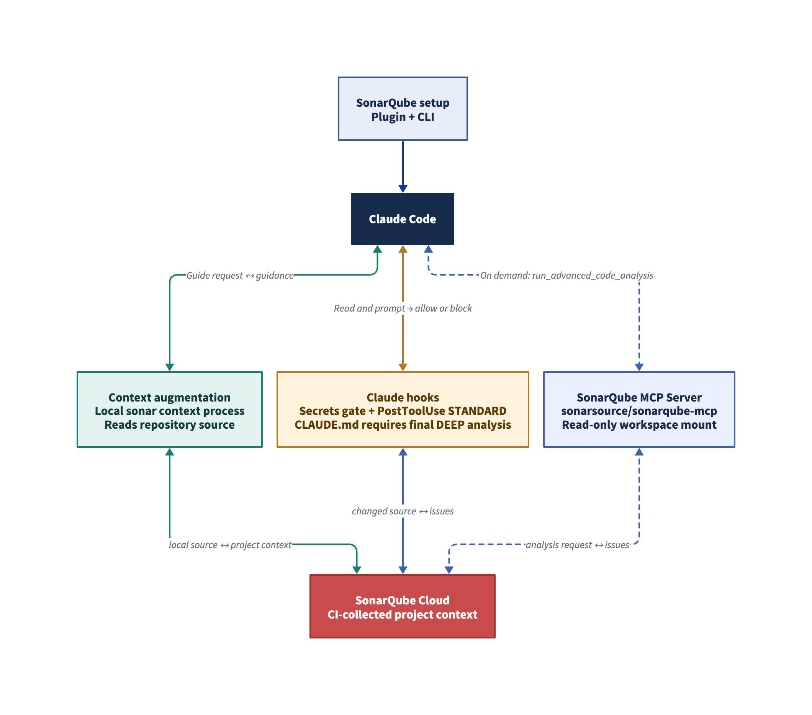
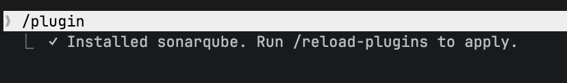
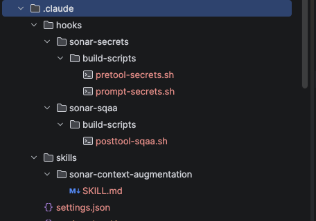
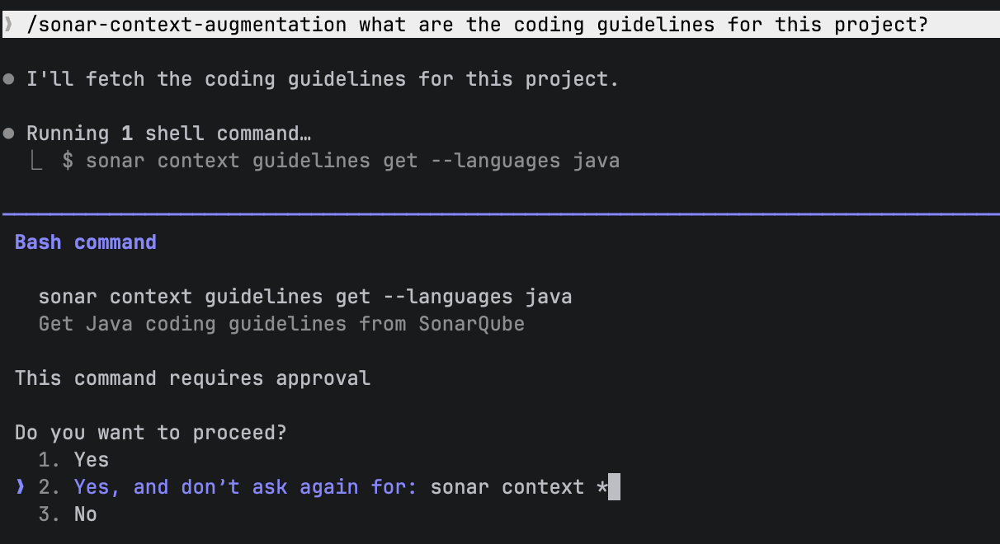
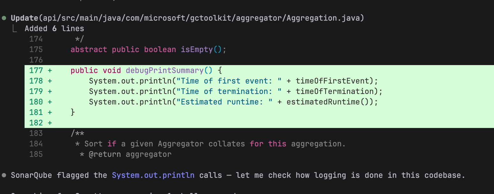
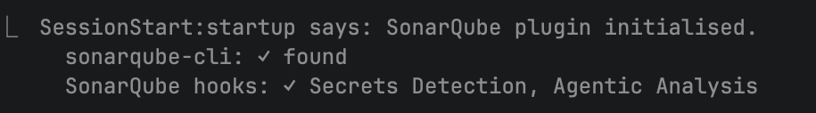

# How to set up Sonar Vortex in Claude Code

## TL;DR overview

- Sonar Vortex brings project-specific coding standards and code verification into Claude Code, so teams can load relevant guidance and constraints before coding and catch issues in seconds rather than wait for CI.
- In the demo, Claude Code used SonarQube feedback to correct issues introduced by an edit across several rounds, without human intervention. The PostToolUse hook analyzes each Edit or Write action automatically.
- The integration also adds secrets detection for prompts and file reads, plus multi-file `DEEP` analysis for cross-file issue detection.
- The guide covers the Claude Code plugin path. Agentic analysis, architecture, and navigation support different language sets, including Java, Python, JavaScript, TypeScript, and C\#, with CLI alternatives for scripted environments.

This blueprint sets up [Sonar Vortex](https://www.sonarsource.com/products/sonar-vortex/) inside Claude Code so your agent receives project-specific coding standards before generating code and verifies every edit against SonarQube's full analysis engine in seconds. The demo uses a fork of Microsoft's [gctoolkit](https://github.com/microsoft/gctoolkit) (Java/Maven). The availability of each capability depends on its supported language and project requirements.

Two Vortex capabilities run inside your agent's coding loop: context augmentation (Guide) injects your project's rules, architecture, and constraints into the agent's context, and agentic loop verification (Verify) runs CI-grade analysis on every file the agent touches without waiting for a pipeline.

## When to use this

You want Claude Code to follow your project's existing coding standards and catch issues as it writes code, not after a PR triggers CI. This blueprint covers the Claude Code plugin path. If you're setting up from the SonarQube CLI instead, see the [SonarQube CLI commands reference](https://docs.sonarsource.com/sonarqube-cli/using-sonarqube-cli/commands).

## What you'll achieve

- SonarQube plugin installed in Claude Code with the MCP server running in a Docker container
- Context augmentation delivering coding guidelines, architecture constraints, dependency health checks where available, and semantic code navigation to the agent before it generates code
- Automatic agentic analysis on every code edit via a PostToolUse hook, with results returned in seconds
- Secrets detection hooks preventing credentials from leaking into agent prompts
- Multi-file DEEP analysis available from the CLI for cross-file issue detection

## Architecture



The integration has two layers. The **SonarQube plugin** gives Claude Code a base MCP server configuration, setup skills, and a SessionStart hook that validates CLI and hook status on each session. The **SonarQube CLI** (invoked through the plugin's `/sonarqube:sonar-integrate` skill) adds project-specific wiring. That wiring includes a PostToolUse hook for agentic analysis, PreToolUse and UserPromptSubmit hooks for secrets detection, the context augmentation skill, and a project-scoped MCP config.

Those two layers produce two separate tool surfaces. With the project-scoped configuration used in this walkthrough, the MCP server exposed 19 tools through Docker for project queries, issue management, and on-demand code analysis. Context augmentation tools for coding guidelines, architecture, navigation, and dependency checks run through a separate local binary accessed via the `/sonar-context-augmentation` skill. The binary runs natively on your machine rather than inside the Docker container, giving it direct filesystem access for navigation and architecture queries.

## What you need before setting up SonarQube with Claude Code

- [SonarQube Cloud](https://www.sonarsource.com/products/sonarqube/cloud/) account on a Team (annual billing) or Enterprise plan
- [Sonar Agent Essentials](https://www.sonarsource.com/products/agent-essentials) subscription active for your org. This is a separate purchase from the SonarQube Cloud plan. See [plans and pricing](https://www.sonarsource.com/plans-and-pricing/sonarcloud/).
- Claude Code installed and working
- Docker Desktop, Podman, or Nerdctl running, because the MCP server runs as a Docker container
- A project already analyzed in SonarQube Cloud on a long-lived branch (e.g., `main`). Both context augmentation and agentic analysis need data from a prior CI analysis. Without it, agentic analysis has no project context to restore, and context augmentation has no issue history to generate guidelines from. If you haven't set this up yet, follow [the SonarQube Cloud GitHub Actions guide](https://docs.sonarsource.com/sonarqube-cloud/analyzing-source-code/ci-based-analysis/github-actions-for-sonarcloud/). Automatic Analysis is not sufficient for Java projects (results are degraded).
- The SonarQube CLI is installed automatically during the integration step, but if you prefer to install it beforehand, see [cli.sonarqube.com](https://cli.sonarqube.com)

## Step 1: Plugin installed and activated

Open Claude Code in any directory and install the SonarQube plugin from the Anthropic plugin marketplace:

```text
/plugin
```

Select the SonarQube plugin.



After installation completes:

```text
/reload-plugins
```

The plugin is now loaded but not yet wired to your project.

## Step 2: Integration configured

Open a new Claude Code session in your project directory. The plugin's SessionStart hook fires and checks for existing integration. If setup is incomplete, it tells you.

Run the integration skill:

```text
/sonarqube:sonar-integrate
```

The skill walks through four checks:

1. **CLI check** — verifies the SonarQube CLI is installed and runs `sonar self-update` to ensure v1.3.0 or later. If the CLI isn't installed, it shows install commands.
2. **Auth check** — runs `sonar auth status`. If you're already authenticated to SonarQube Cloud, it skips ahead.
3. **Auth login** — if not authenticated, select your SonarQube Cloud region (EU or US), enter your org key, and complete browser-based authentication.
4. **Integration** — asks whether to configure for the current project or globally. Choose "Current project only" (recommended). The skill runs `sonar integrate claude` under the hood.

The integration summary confirms:

```text
✅ SonarQube integration is ready.

  sonarqube-cli:     up to date (v1.3.0)
  Authentication:    token stored in system keychain (sonarcloud.io / <your-org>)
  MCP Server:        configured (ensure a container runtime (Docker, Podman,
                     or Nerdctl) is running, then restart the agent session
                     if tools do not appear)
  Secrets scanning:  hooks registered via sonar integrate claude
```

## Step 3: What it configured

After integration, your project directory contains three new configuration surfaces. If you select agentic analysis instructions during a project-scoped integration, the CLI adds a fourth:

**MCP server config** (`.mcp.json`):

```json
{
  "mcpServers": {
    "sonarqube": {
      "command": "sonar",
      "args": ["run", "mcp", "--project", "<YOUR_PROJECT_KEY>"]
    }
  }
}
```

The `sonar run mcp` command launches the `sonarsource/sonarqube-mcp` Docker container with stdio transport. No `--toolsets` flag appears here. The CLI passes a curated set of tool categories to the container (issues, rules, quality gates, coverage, analysis, and others), excluding context augmentation tools because those run through the local binary instead.

**Hook configuration** (`.claude/settings.json`):

```json
{
  "hooks": {
    "PreToolUse": [
      {
        "matcher": "Read",
        "hooks": [{
          "type": "command",
          "command": ".claude/hooks/sonar-secrets/build-scripts/pretool-secrets.sh",
          "timeout": 60
        }]
      }
    ],
    "UserPromptSubmit": [
      {
        "matcher": "*",
        "hooks": [{
          "type": "command",
          "command": ".claude/hooks/sonar-secrets/build-scripts/prompt-secrets.sh",
          "timeout": 60
        }]
      }
    ],
    "PostToolUse": [
      {
        "matcher": "Edit|Write",
        "hooks": [{
          "type": "command",
          "command": ".claude/hooks/sonar-sqaa/build-scripts/posttool-sqaa.sh",
          "timeout": 60
        }]
      }
    ]
  }
}
```

Each hook serves a different purpose:

- **PreToolUse** (matcher: `Read`) — secrets detection. Scans file content before it enters the agent's context.
- **UserPromptSubmit** (matcher: `*`) — secrets detection. Scans every user prompt for credentials before processing.
- **PostToolUse** (matcher: `Edit|Write`) — agentic analysis. Fires after every code edit, sending the changed file to SonarQube Cloud's analysis engine.

The PostToolUse hook points to a shell script wrapper, not the CLI directly. The script checks for the `sonar` CLI on PATH (exiting silently if missing) and then calls:

```shell
sonar hook claude-post-tool-use --project '<YOUR_PROJECT_KEY>'
```

**Agent instructions** (`CLAUDE.md`, when selected):
When agentic analysis is available in a project-scoped configuration, the CLI offers an agentic analysis instructions feature. Selected it adds a managed protocol to the project-root `CLAUDE.md`. The protocol tells Claude Code to run `sonar analyze agentic -depth DEEP` before it completes a turn that changes files, then reruns the analysis after it corrects findings on lines it changed.

**Hook scripts and skill** (`.claude/hooks/` and `.claude/skills/`):
The `sonar-context-augmentation` skill is how Claude Code accesses context augmentation tools. It calls `sonar context` CLI commands, which talk to a local native binary rather than the Docker container.



## Step 4: Context augmentation working

Context augmentation provides four capability categories: coding guidelines based on your project's issue history, architecture constraints (module dependency graph and allowed couplings), dependency health checks where available (vulnerability, malware, and license compliance), and semantic code navigation (AST-based search, call flow tracing, type hierarchy).

The integration installs a project-scoped `/sonar-context-augmentation` skill. In this walkthrough, the skill was invoked explicitly to show the returned guidance and constraints, as Claude Code can invoke it when the task calls for project context, but the behavior is not guaranteed. If coding guidelines are desired when running a task, invoke the skill explicitly or enforce the workflow in project instructions.

Invoke the skill:

```text
/sonar-context-augmentation what are the coding guidelines for this project?
```

The skill calls `sonar context guidelines get` under the hood. You'll see it runs a shell command, and then project-specific guidelines returned as a formatted table.



The guidelines reflect your project's actual issue history in SonarQube Cloud. A project with many resource leak issues surfaces "close resources" prominently; a project with naming violations leads with naming conventions.

To explore architecture, invoke the skill again:

```text
/sonar-context-augmentation show me the top-level architecture of this project
```

The skill calls `sonar context architecture get-current --ecosystem java --depth 0` and returns root-level modules with their fully qualified names. Architecture tools support Java, JavaScript, TypeScript, Python, and C\#.

Semantic navigation tools (call flow tracing, type hierarchy, reference lookup, signature and body search) support Java, C\#, JavaScript, TypeScript, Python, and Rust. These are also accessed through the same skill and run through the local binary.

## Step 5: Agentic analysis verifying code edits

Agentic analysis fires automatically. Every time Claude Code uses the Edit or Write tool, the PostToolUse hook sends the changed file to SonarQube Cloud's analysis engine and returns results within seconds.

Ask Claude Code to make a code change:

```text
In Aggregation.java, add a public method called debugPrintSummary that prints
the time of first event, time of termination, and estimated runtime to stdout
```

After Claude Code edits the file, the PostToolUse hook fires.

In the demo, Claude Code added the method using `System.out.println`. SonarQube flagged the `System.out` calls immediately. Without being prompted, the agent searched the codebase for the project's logging pattern (`java.util.logging.Logger`), replaced `System.out.println` with `LOGGER.info()`, and then caught a second issue: SonarQube flagged string concatenation in the log calls because it constructs the string even when the log level is disabled. The agent switched to supplier lambdas (`LOGGER.info(() -> "...")`) to defer evaluation.

The agent corrected the issues introduced by the change through three rounds of feedback, without human intervention. The final DEEP analysis still reported two pre-existing `java:S1124` issues elsewhere in the file.



The PostToolUse hook and the `run_advanced_code_analysis` MCP tool both invoke SonarQube Cloud agentic analysis. The hook fires automatically on every edit, sending one file per invocation. The MCP tool is on-demand, available through the `/sonarqube:sonar-analyze` skill or direct tool calls. For cross-file detection, use multi-file analysis (Step 6).

## Step 6: Multi-file DEEP analysis

Single-file analysis runs automatically via the hook. The `CLAUDE.md` directs the agent to use cross-file analysis at the end of its turn, and you can also use the CLI directly with multiple `--file` flags:

```shell
sonar analyze agentic \
  --file api/src/main/java/com/microsoft/gctoolkit/aggregator/Aggregation.java \
  --file api/src/main/java/com/microsoft/gctoolkit/aggregator/Aggregator.java
```

When you pass two or more files, the CLI activates DEEP mode automatically. DEEP analysis sends all files together so the engine can detect issues that span file boundaries.

Sample output:

```text
  !  api/src/main/java/.../Aggregation.java · 2 issues
     [1] line 173  Reorder the modifiers to comply with the Java Language Specification.  java:S1124
     [2] line 179  Reorder the modifiers to comply with the Java Language Specification.  java:S1124
  !  api/src/main/java/.../Aggregator.java · 2 issues
     [1] line 178  Merge this if statement with the enclosing one.  java:S1066
     [2] line 172  Refactor this method to reduce its Cognitive Complexity from 18 to the 15 allowed.  java:S3776

2 files analyzed · 2 with issues · 4 issues found · DEEP analysis
```

The `--project` and `--branch` flags are optional when you run from a configured project directory as the CLI infers both from `.mcp.json`. You only need them when running from outside the project or targeting a different branch.

To force a specific analysis depth on a single file:

```shell
sonar analyze agentic \
  --file api/src/main/java/com/microsoft/gctoolkit/aggregator/Aggregation.java \
  --depth DEEP
```

The `--depth` flag accepts `STANDARD` (default for single files) or `DEEP` (default for multiple files). If the payload is too large, the CLI splits files into smaller batches automatically.

## Verify the setup

After completing the steps above, confirm the full integration is working. Start a fresh Claude Code session in the project directory.

**SessionStart hook fires:**



If you see "SonarQube hooks: ✗" or no SessionStart output at all, the plugin isn't loaded. Run `/reload-plugins`.

**MCP tools available:** Ask Claude Code to list MCP tools. In this demo, Claude Code listed 19 tools, including `run_advanced_code_analysis`. Context augmentation tools (`get_guidelines`, `get_current_architecture`, navigation tools) will not appear in this list. The `/sonar-context-augmentation` skill serves them instead.

**Context augmentation and agentic analysis respond:** Confirm `/sonar-context-augmentation` returns project-specific results, and that editing a file (e.g., adding a `System.out.println` in Java) triggers the PostToolUse hook with analysis findings.

**Docker container is running:** In a separate terminal:

```shell
docker ps --filter "ancestor=sonarsource/sonarqube-mcp" --format "table {{.Image}}\t{{.Status}}"
```

```text
IMAGE                       STATUS
sonarsource/sonarqube-mcp   Up 3 days
```

**Assembled configuration state.** If any verification step failed, cross-check these files against the examples in Step 3:

| File | Contains | Purpose |
| :---- | :---- | :---- |
| `CLAUDE.md` | Managed agentic analysis protocol | End-of-turn analysis instructions |
| `.mcp.json` | `sonar run mcp --project <key>` | MCP server launch command |
| `.claude/settings.json` | Three hook entries (PreToolUse, UserPromptSubmit, PostToolUse) | Secrets detection \+ agentic analysis triggers |
| `.claude/hooks/sonar-sqaa/build-scripts/posttool-sqaa.sh` | `sonar hook claude-post-tool-use --project '<key>'` | Agentic analysis hook script |
| `.claude/hooks/sonar-secrets/build-scripts/` | `pretool-secrets.sh`, `prompt-secrets.sh` | Secrets detection hook scripts |
| `.claude/skills/sonar-context-augmentation/SKILL.md` | Skill definition with `sonar context` commands | Context augmentation access |

## What to know

**Context augmentation requires explicit invocation.** The `/sonar-context-augmentation` skill should be invoked at the start of each coding task. Without it, Claude Code does not always automatically follow your project's coding guidelines. The skill's own instructions say "ALWAYS invoke this skill on the first prompt," but that instruction is guidance to the agent, not automatic enforcement.

**Agentic analysis needs a prior CI analysis.** If your project hasn't been analyzed in CI on a long-lived branch, the agentic analysis hook will fail silently or return degraded results. The analysis engine restores CI-collected context (compiled artifacts, type information, dependency graphs) to run its full rule set. A project that has only been scanned through Automatic Analysis may not have this context for Java.

**Stdio transport is required for MCP-delivered capabilities.** MCP-delivered context augmentation and `run_advanced_code_analysis` require stdio transport, which is what the `sonar integrate claude` path configures. The Claude PostToolUse hook invokes the CLI directly.

| Capability | Supported languages |
| :---- | :---- |
| Agentic analysis | Java, Python, JS/TS, CSS, HTML, XML, C\#, VB.NET, C++, plus secrets and IaC (Docker, Kubernetes, Terraform) |
| Navigation (call flow, type hierarchy, references) | Java, C\#, JS/TS, Python, Rust |
| Architecture (module graph, dependency constraints) | Java, JS/TS, Python, C\# |

**Alternative setup paths exist.** This blueprint uses the Claude Code plugin path. You can also set up from the CLI directly with `sonar integrate claude` (for scripted or non-interactive environments) or `sonar integrate` (an interactive menu added in CLI v1.3.0 for discovering all available integrations). The [SonarQube CLI commands reference](https://docs.sonarsource.com/sonarqube-cli/using-sonarqube-cli/commands) covers the CLI entry point in detail.

## Next steps

- [Sonar Vortex documentation](https://docs.sonarsource.com/agent-centric-development-cycle/guide/sonar-vortex-context-augmentation) — full reference for context augmentation configuration and capabilities
- [Agentic analysis documentation](https://docs.sonarsource.com/agent-centric-development-cycle/verify/sonar-vortex-agentic-analysis) — supported languages, analysis depth modes, and CI prerequisites
- [SonarQube CLI reference](https://docs.sonarsource.com/sonarqube-cli) — all CLI commands including `sonar context`, `sonar analyze`, and `sonar remediate`
- [SonarQube MCP Server setup](https://docs.sonarsource.com/sonarqube-mcp-server) — environment variables, toolset configuration, and transport modes
